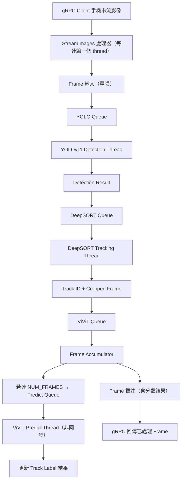

# Cat-State-Detection


本專案整合了 **YOLOv11**、**DeepSORT** 與 **ViViT** 影片分類技術，實現對影片中目標物（如貓、車輛等）的即時偵測、追蹤與分類。  
這個系統可用於監控、智能交通、動物行為分析、體育賽事等多種應用場景。

---

## 目錄

- [簡介](#簡介)
- [功能特性](#功能特性)
- [系統架構](#系統架構)
- [安裝與環境配置](#安裝與環境配置)
- [使用方法](#使用方法)
- [範例](#範例)
- [未來計劃](#未來計劃)
- [License](#license)

---

## 簡介

本專案結合了三大核心技術：
- **YOLOv11**：作為目標偵測模型，負責從影像中提取目標的邊界框與分類資訊（例如偵測貓、車輛等）。
- **DeepSORT**：利用物體的外觀特徵與運動信息實現多目標追蹤，確保在影片中對同一個目標分配一致的 ID。
- **ViViT**：應用於影片分類，根據影片內容對視頻進行高階語義分類，如動作識別、事件檢測等。

透過這些模組，我們可以從影片中同時完成物體偵測、追蹤及分類任務，並且將結果輸出為標記好的影片或報告。

---

## 功能特性

- **目標偵測**：採用 YOLOv11 模型，支援多種類別物體偵測，可根據需求進行調整（例如僅針對貓進行偵測）。
- **多目標追蹤**：基於 DeepSORT 的追蹤算法，實現穩定的目標追蹤，避免 ID 混亂。
- **影片分類**：利用 ViViT 模型對影片進行分類，快速辨識影片中的主要內容與場景。
- **結果可視化**：在影片上疊加邊界框、追蹤 ID 與分類標籤，並支持影片輸出存檔。
- **靈活擴展**：代碼結構模塊化，方便自定義模型、參數調整與新功能擴展。

---

## 系統架構



---

## 安裝與環境配置

### 1. 環境需求

- Python 3.8 以上
- PyTorch（建議 1.7 以上版本）
- OpenCV
- Ultralytics YOLO (請確保你已經獲取 YOLOv11 的模型檔案)
- DeepSORT (deep_sort_realtime)
- ViViT 依賴庫（根據你所採用的 ViViT 實現，可參考官方文件）

### 2. 安裝依賴

請先安裝虛擬環境（可選）並安裝相應依賴：

```bash
# 建立並啟動虛擬環境（可選）
python -m venv venv
source venv/bin/activate  # Linux / macOS
venv\Scripts\activate  # Windows

# 安裝必要的 Python 套件
pip install torch torchvision
pip install opencv-python
pip install ultralytics
pip install deep_sort_realtime
pip install timm  # 如果 ViViT 所需
# 根據你的 ViViT 實現安裝其他依賴
```

---

## 使用方法

1. **模型準備**  
   - 將 YOLOv11 模型權重（例如 `yolov11.pt`）放在專案目錄下或指定路徑。
   - 配置 DeepSORT 與 ViViT 所需模型權重，並確認路徑配置正確。

2. **修改參數**  
   - 根據需求編輯程式碼中的參數，例如輸入影片路徑、輸出影片路徑、信心閾值、追蹤器參數（如 `max_age`）等。
   - 可根據物件種類需求（例如只偵測貓）修改 YOLO 偵測過濾條件。

3. **執行主程式**  
   運行主程式，即可進行影片的目標偵測、追蹤及分類：
   ```bash
   python main.py
   ```

4. **查看輸出**  
   程式將會在視窗中顯示追蹤與分類結果，同時生成標記後的影片檔案。

---

## 範例

範例目錄結構：
```
YOLOv11-DeepSORT-ViViT/
├── models/
│   ├── yolov11.pt
│   ├── vivit_model.pth
├── videos/
│   ├── input_video.mp4
│   └── output_video.mp4
├── main.py
├── README.md
└── requirements.txt
```

在 `main.py` 中整合了 YOLOv11、DeepSORT 與 ViViT 的調用範例，請參考內部註解瞭解如何使用各模組。

---

## 未來計劃

- **多類別支援**：除貓之外擴展其他物件類別的偵測與追蹤。
- **線上部署**：結合 Flask 或 FastAPI 實現線上視訊監控系統。
- **性能優化**：透過模型剪枝與量化，提升實時處理速度。
- **多模態融合**：整合更多語意信息，提升影片分類準確度。

---

## License

本專案採用 MIT License，詳情請參考 [LICENSE](LICENSE) 文件。

---

歡迎大家提出 Issue 或 Pull Request，一起讓此專案變得更好！

---

這是一個基本的 README 範例，你可以根據專案具體需求進一步豐富內容。希望這對你有所幫助！
