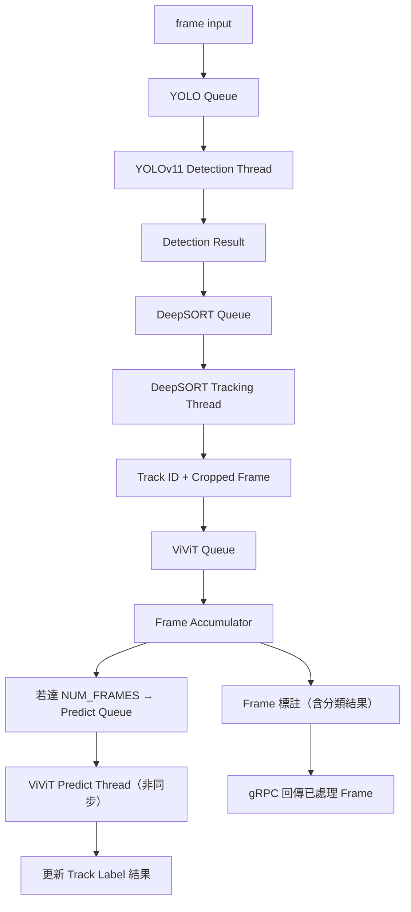

# Cat-State-Detection


本專案整合了 **YOLOv11**、**DeepSORT** 與 **ViViT** 影片分類技術，實現對串流中貓的即時偵測、追蹤與分類。  
這個系統可用於監控、分析貓的行為等多種應用場景。

---

## 目錄

- [簡介](#簡介)
- [功能特性](#功能特性)
- [系統架構](#系統架構)
- [安裝與環境配置](#安裝與環境配置)
- [使用方法](#使用方法)
- [範例](#範例)
- [未來計劃](#未來計劃)
- [License](#license)

---

## 簡介

本專案結合了三大核心技術：
- **YOLOv11**：作為目標偵測模型，負責從影像中提取目標的邊界框與分類資訊（例如偵測貓、車輛等）。
- **DeepSORT**：利用物體的外觀特徵與運動信息實現多目標追蹤，確保在影片中對同一個目標分配一致的 ID。
- **ViViT**：應用於影片分類，根據影片內容對視頻進行高階語義分類，如動作識別、事件檢測等。

透過這些模組，我們可以從串流中及時完成物體偵測、追蹤及分類任務，並且將結果輸出回使用者端。

---

## 功能特性

- **目標偵測**：採用 YOLOv11 模型，支援多種類別物體偵測，可根據需求進行調整（例如僅針對貓進行偵測）。
- **多目標追蹤**：基於 DeepSORT 的追蹤算法，實現穩定的目標追蹤，避免 ID 混亂。
- **影片分類**：利用 ViViT 模型對影片進行分類，快速辨識影片中的主要內容與場景。
- **結果可視化**：在影片上疊加邊界框、追蹤 ID 與分類標籤，並支持影片輸出存檔。
- **靈活擴展**：代碼結構模塊化，方便自定義模型、參數調整與新功能擴展。

---

## 系統架構



---
## 專案檔案說明

| 檔名 | 說明 |
|------|------|
| main.dart | 在flutter資料夾中的lib資料夾裡面，作為手機即時串流的程式碼，請下載完整flutter資料夾在打開 |
| class.txt | vivit影片分類類別 |
| model.py | ViViT 模型實作程式碼（使用 Model 2） |
| model_util.py | 模型輔助功能，例如 patch 嵌入等工具函數 |
| grpc_server.py | 架設server已進行即時串流影片分類|
| yolo.py | 訓練yolo模型用 |
| yolo11n.pt | 訓練完成後效果最佳的yolo模型|
| image_stream_pb2.py | grpc串流協定用|
| image_stream_pb2_grpc.py | grpc串流協定用|
---

## 安裝與環境配置

### 1. 環境需求

- Python 3.8 以上
- PyTorch（建議 1.7 以上版本）
- OpenCV
- Ultralytics YOLO (請確保你已經獲取 YOLOv11 的模型檔案)
- DeepSORT (deep_sort_realtime)

### 2. 安裝依賴

安裝已訓練過的yolo model(best.pt)
https://drive.google.com/drive/folders/17Z2FRdZFr2-OWmDI5I_4xlqVQeWkCLvg?usp=drive_link

安裝虛擬環境（可選）並安裝相應依賴：

```bash

# 安裝必要的 Python 套件
pip install torch torchvision
pip install opencv-python
pip install ultralytics
pip install deep_sort_realtime

```
 
---

## 使用方法

### 模型部分（Model）

#### 準備模型權重

請將 YOLOv11 模型權重（例如 `yolov11.pt`）放置於專案根目錄或指定的模型路徑下。  
同時準備 ViViT 模型與 DeepSORT 追蹤模型所需的參數檔案，並確認在程式碼中所設定的路徑正確。

#### 參數設定

根據實際需求調整以下參數：

- 輸入影片路徑  
- 輸出影片儲存路徑  
- YOLO 信心閾值（confidence threshold）  
- DeepSORT 追蹤器參數（如 `max_age`, `n_init` 等）

---

### Server 部分（gRPC 分類伺服器）

#### 啟動伺服器

執行以下指令以啟動 gRPC server：

```bash
python grpc_server.py
```
#### 成功驗證

若出現以下訊息，表示伺服器啟動成功：

gRPC Server listening on port 50051

### Camera 部分（Flutter 相機應用）

#### 執行方式

使用 `flutter_application_camera/lib/main.dart` 作為主入口，並透過下列方式其一進行執行：

- 模擬器方式：
  - 使用 Android Studio 模擬器執行 `main.dart`

- 實體手機方式：
  - 使用 USB 連接 Android 裝置
  - 手機需啟用「開發者模式」
  - 開啟「USB 偵錯」及「透過 USB 安裝應用程式」
  - 確認已安裝正確驅動與授權

#### 啟動相機串流

執行以下指令以啟動 Flutter 相機應用：

```bash
flutter run
```
---

## 範例

範例目錄結構：
```
YOLOv11-DeepSORT-ViViT/
├── models/
│   ├── best.pt
│   ├── vivit_model.pth
│   ├── class.txt
├── grpc_server.py
├── README.md
└── requirements.txt
```

在 `grpc_server.py` 中整合了 YOLOv11、DeepSORT 與 ViViT 的調用範例，請參考內部註解瞭解如何使用各模組。

---

## 未來計劃

- **多類別支援**：除貓之外擴展其他物件類別的偵測與追蹤。
- **性能優化**：透過模型剪枝與量化，提升實時處理速度。
- **多模態融合**：整合更多語意信息，提升分類準確度。

---

## License

本專案採用 MIT License，詳情請參考 [LICENSE](LICENSE) 文件。

---

歡迎大家提出 Issue 或 Pull Request，一起讓此專案變得更好！

---

